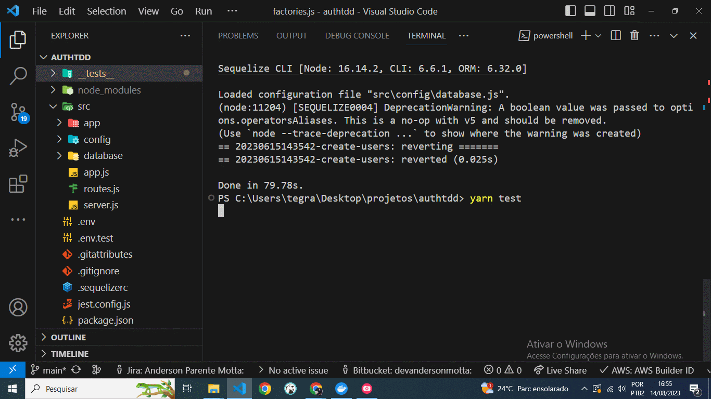

# 🌂 authTddJest

Projeto com login, e testes unitários e de integração TDD com Jest.

Aplicação desenvolvida com JavaScript, Docker, Jest e ORM Sequelize.

## Pré-requisitos

Visual Studio Code  
Docker  

## Uso
Clone o Projeto no GitHub:
https://github.com/1andersonmotta/authTddJest.git  

Abra o projeto com Visual Studio Code.  

No terminal execute: yarn install  

Instale o Docker: https://www.docker.com/  

Crie e Rode um contâner com comando: docker run --name postgres-container -e POSTGRES_PASSWORD=docker -e POSTGRES_USER=docker -e POSTGRES_DB=nodeauth -p 5432:5432 -d postgres  

Execute os teste com: yarn test

## 🛠 Ferramentas

- [JavaScript](https://developer.mozilla.org/pt-BR/docs/Web/JavaScript)
- [Docker](https://www.docker.com/)
- [Jest](https://jestjs.io/pt-BR/)

## Contribuição

Se você tem alguma Sugestão enviar para devandersonmotta@gmail.com com o assunto: "contribuição authTddJest" ou entre em contato pelo Linkedin.

## Licença

MIT

## ✉ Contato

email: devandersonmotta@gmail.com

linkedin: www.linkedin.com/in/anderson-motta-96b138235
---

## 💡 Objetivo

Praticar implementação de Testes Unitários e de Integração com a ferramenta Jest, conteinerização do Banco de dados Postgres com Docker. 

